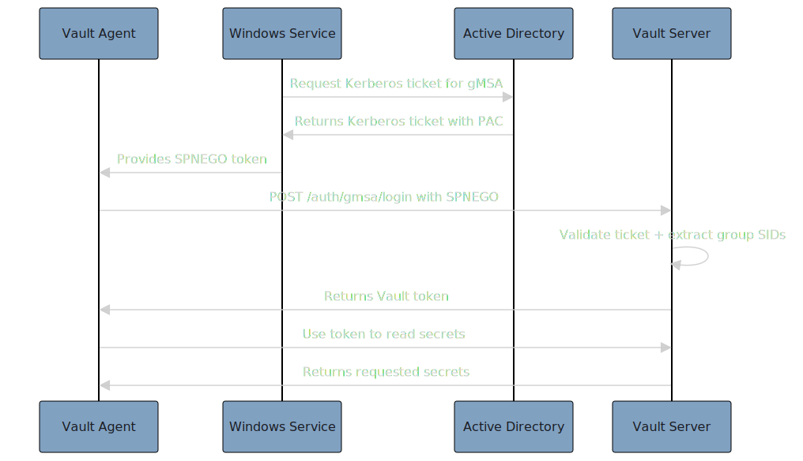

Yes, absolutely! The vault-plugin-auth-gmsa auth method is specifically designed for this exact use case. Let me explain how a Vault Agent running under a Group Managed Service Account (gMSA) can use this auth method to authenticate and read secrets.

## 🔐 **How Vault Agent + gMSA Authentication Works**

### **1. ✅ Perfect Use Case Match**
This auth method is **exactly** what you need for:
- Vault Agent running as a Windows service
- Task Scheduler jobs using gMSA
- Automated secret retrieval without hardcoded credentials
- Secure service-to-service authentication

### **2. 🚀 Authentication Flow**



### **3. 📋 Implementation Steps**

#### **Step 1: Configure Vault Auth Method**
```bash
# Enable the auth method
vault auth enable gmsa

# Configure the auth method
vault write auth/gmsa/config \
    realm="YOURDOMAIN.COM" \
    keytab="base64-encoded-keytab" \
    spn="HTTP/vault.yourdomain.com" \
    clock_skew_sec=300

# Create a role for the gMSA
vault write auth/gmsa/role/my-gmsa-role \
    token_policies="my-secrets-policy" \
    token_ttl=1h \
    token_max_ttl=24h \
    allowed_realms="YOURDOMAIN.COM" \
    allowed_spns="HTTP/vault.yourdomain.com" \
    bound_group_sids="S-1-5-21-1234567890-1234567890-1234567890-1234"
```

#### **Step 2: Configure Vault Agent**
```hcl
# vault-agent.hcl
pid_file = "./pidfile"

auto_auth {
    method "gmsa" {
        config = {
            role = "my-gmsa-role"
        }
    }
}

vault {
    address = "https://vault.yourdomain.com"
}

template {
    source      = "./secrets.tpl"
    destination = "./secrets.json"
    perms       = 0644
}
```

#### **Step 3: Run Vault Agent as gMSA**
```powershell
# Install Vault Agent as Windows Service
sc.exe create "VaultAgent" binpath="C:\vault\vault.exe agent -config=C:\vault\vault-agent.hcl" start=auto

# Configure service to run under gMSA
sc.exe config "VaultAgent" obj="DOMAIN\gmsa-account$"
sc.exe config "VaultAgent" password=""

# Start the service
sc.exe start "VaultAgent"
```

### **4. 🔧 Key Configuration Points**

#### **gMSA Requirements:**
- gMSA must have `HTTP/vault.yourdomain.com` SPN
- gMSA must be in the AD groups specified in `bound_group_sids`
- gMSA must have permission to request Kerberos tickets

#### **Vault Agent Configuration:**
- Must run under the gMSA identity
- Must have access to the keytab (if using file-based keytab)
- Must be able to reach the Vault server

#### **Network Requirements:**
- Vault Agent must be able to reach the Vault server
- Vault server must be able to reach the domain controller
- Proper DNS resolution for Kerberos realm

### **5. �� Example Vault Agent Template**

```hcl
# secrets.tpl
{{ with secret "secret/my-app" }}
{
  "database_password": "{{ .Data.password }}",
  "api_key": "{{ .Data.api_key }}",
  "last_updated": "{{ .Data.metadata.updated_time }}"
}
{{ end }}
```

### **6. ✅ Benefits of This Approach**

- **No Hardcoded Credentials**: gMSA provides automatic authentication
- **Automatic Token Renewal**: Vault Agent handles token refresh
- **Group-Based Access**: Access controlled by AD group membership
- **Audit Trail**: All authentication events logged with security flags
- **High Availability**: Works with Vault clustering
- **Secure**: Uses Kerberos authentication with PAC validation

### **7. 🔍 Troubleshooting Tips**

If authentication fails, check:
- gMSA has correct SPN: `setspn -L DOMAIN\gmsa-account$`
- gMSA is in required AD groups
- Vault Agent is running under gMSA identity
- Network connectivity to Vault server
- Clock synchronization (Kerberos is time-sensitive)

### **8. 🚀 Production Considerations**

- **Keytab Security**: Store keytab securely, rotate regularly
- **Token TTL**: Set appropriate token lifetimes for your use case
- **Monitoring**: Monitor authentication success/failure rates
- **Backup**: Ensure gMSA has backup authentication methods

This auth method is **perfectly suited** for your Vault Agent + gMSA use case and provides enterprise-grade security for automated secret management!